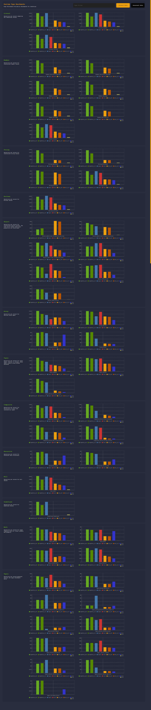

# Runtime Type Validation Benchmarks

High Performance Validation Benchmarks for JavaScript

### Overview

This project measures a set of high performance JavaScript runtime type checking libraries to adequately compare their validation performance across a wide range of data structures. It also seeks to compare JIT to AOT performance by measuring static JavaScript validation routines against those dynamically evaluated at runtime.

### Benchmarks

These benchmarks measure validation throughput for a number of common JavaScript data structures. The project provides two datasets, one `correct` the other `incorrect` (where-in the `incorrect` dataset is used to trip error handling paths within each validator and test early return performance). Data for each test is hardcoded as not to introduce unnessasary variance in the results as well as to provide high visibility to the actual data being benchmarked. Additionally, each benchmark is run in within an isolated Node process to avoid previous benchmarks breaking optimizations for subsequent benchmarks. All benchmarks can be inspected under the benchmark/validators directory.

### Packages

The following JavaScript validation packages are benchmarked.

| Package                                                              | Compilation               | Assertion Policy | Description                                                                                |
|---                                                                   |---                        |---               |---                                                                                         |
| [ts-runtime-checks](https://github.com/GoogleFeud/ts-runtime-checks) | AOT                       | Structural       | A typescript transformer which automatically generates validation code from your types.    |
| [typia](https://github.com/samchon/typia)                            | AOT                       | Structural       | Super-fast Runtime validator (type checker) with only one line.                            |
| [typebox](https://github.com/sinclairzx81/typebox)                   | JIT (with optional AOT)   | Json Schema      | JSON Schema Type Builder with Static Type Resolution for TypeScript.                       |
| [ajv](https://github.com/ajv-validator/ajv)                          | JIT (with optional AOT)   | Json Schema      | The fastest JSON Schema Validator.                                                         |


### Commands

The following commands are available following an `npm install`

```bash

$ npm run benchmark <iteration-count>         # Runs these benchmarks with an optional iteration 
                                              # count. If not specified the default is 10 million
                                              # iterations. Running the benchmark will write
                                              # results to reporting/results/<lib>/<test>.json.


$ npm run reporting                           # Builds and minifies the reporting website and serves
                                              # it on port 5000. This task will also capture the current 
                                              # websites benchmark results (see image below) which is 
                                              # written to the project root (see screenshot.png)

$ npm run format                              # Runs a prettier pass over the project.

$ npm run clean                               # Remove the target build directory.
```


### Results

The following shows the comparative performance results for the `correct` dataset. Results show as estimated operations per second. You can visit the benchmark results [here](https://sinclairzx81.github.io/runtime-type-benchmarks/).



### Contribute

This project is open to community contribution.